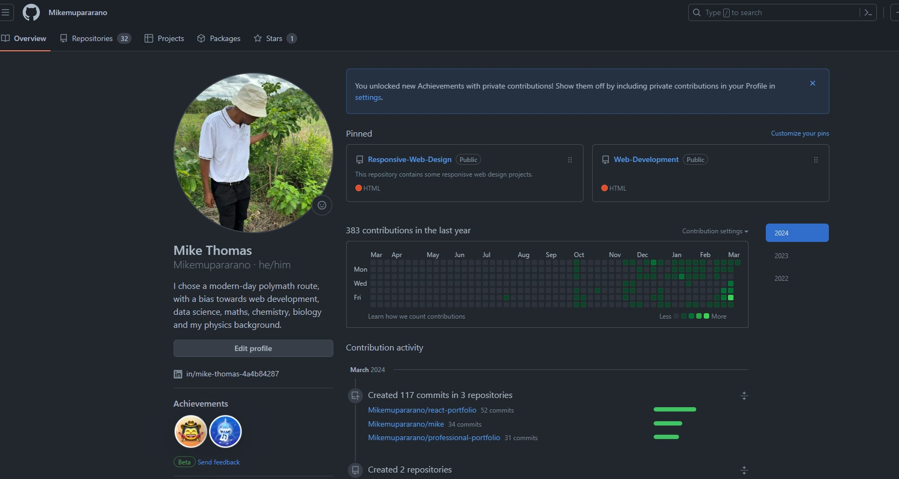
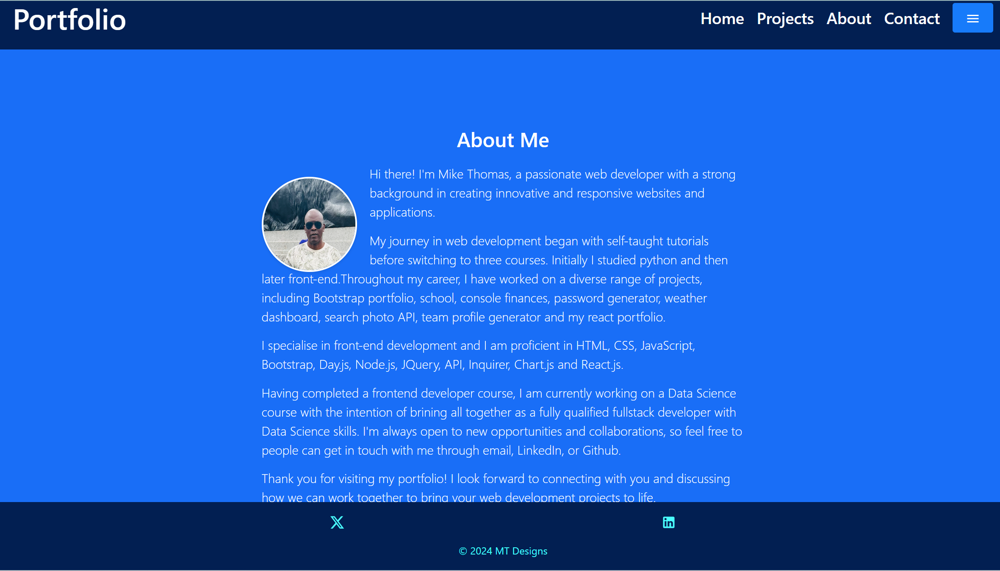
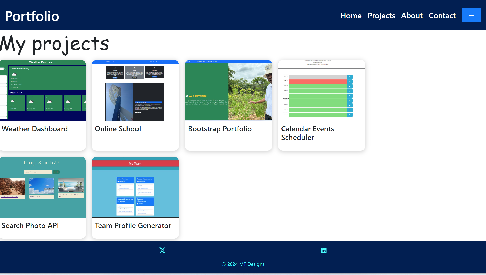
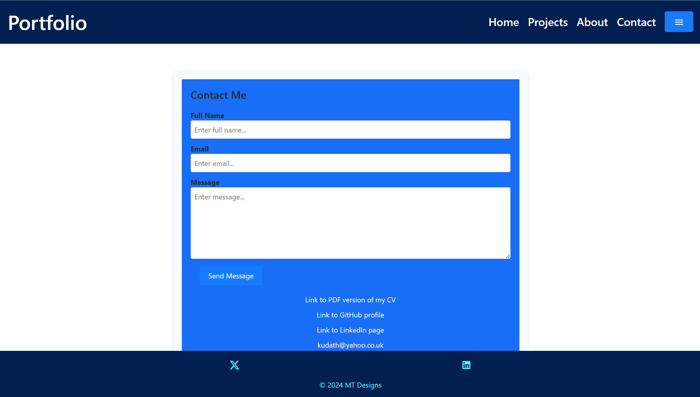

# Professional-portfolio
## Description
I have spent a good amount of hours setting a responsive portfolio using react js.I transformed a Figma design into code to make this a customized and fully responsive portfolio. I have used react, Node Js, bootstrap, HTML and CSS to make the project.  

The figma design that has shaped this portfolio in line with modern trends in tech companies, has one standard view of the web page and another one for the mobile responsive page.

 
## Table of Contents
- [Professional-portfolio](#professional-portfolio)
  - [Description](#description)
  - [Table of Contents](#table-of-contents)
  - [Installation](#installation)
  - [Usage](#usage)
  - [License](#license)
  - [Contributing](#contributing)
  - [Credits](#credits)
  - [Tests](#tests)
  - [Questions](#questions)

## Installation
The user is advised to have downloaded and installed node.js from here: 
N/A

## Usage

A screenshot of the landing page is shown here:

A screenshot of the 'about me' page is shown here:

An image of the projects page is shown here:

The contact page is as follows: 

By clicking the link below, the user is taken to the web page where the project is displayed:https://mikemupararano.github.io/react-portfolio/.
The repository can be accessed using this link: https://github.com/Mikemupararano/react-portfolio.

## License
This application is covered under the MIT license.

## Contributing
 Any users are welcome to contribute ideas to my repository: https://github.com/Mikemupararano/react-portfolio.

## Credits
I researched website and watched several videos to adapt and work out the code in this web application. I used the following web-links for research and support:
(1) https://github.com/thehyperart11/Restaurant-Landing-Page-Tutorial/blob/main/src/App.css
(2) https://github.com/TylerPottsDev/yt-react-hirigana-quiz
(3) https://github.com/Praveenterax/reactjs-portfolio/blob/master/frontend_react/src/containers/Work/Work.jsx
(4) https://www.youtube.com/watch?v=VY6tgKS02ao
(5) https://github.com/soumyajit4419/Portfolio/blob/master/src/components/Projects/ProjectCards.js
(6) https://www.figma.com/proto/tkDs3aeBaqvF47hD063LSH/Untitled?node-id=1-2

## Tests
N/A

## Questions
For any questions or concerns, please contact me at [kudath@yahoo.co.uk](mailto:kudath@yahoo.co.uk).
You can also find me on GitHub: [https://github.com/Mikemupararano](https://github.com/https://github.com/Mikemupararano)
